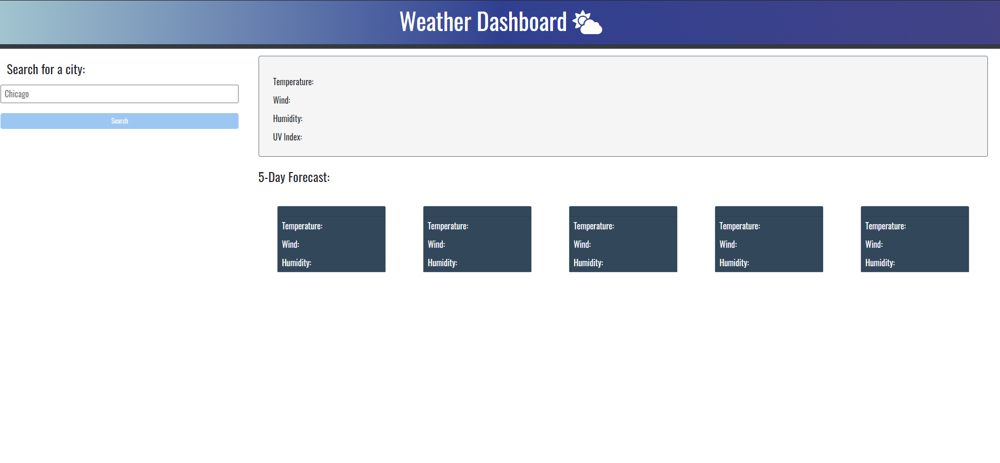

# _Weather-Vision_
> A simple app that lets you view weather in the city you choose.
> Live demo [_here_](https://darolo13.github.io/). 

## Table of Contents
* [Technologies Used](#technologies-used)
* [Features](#features)
* [Screenshot](#screenshot)
* [Project Status](#project-status)
* [Room for Improvement](#room-for-improvement)

## Technologies Used
- Tech 1 - JavaScript
- Tech 2 - CSS
- Tech 3 - HTML

## Features
Ready Features:
1. ** **

## Screenshot
### Weather-Vision:

## Project Status
Project is: _in progress_

## Room for Improvement
Room for improvement:
- 
- 

To do:
-
-
-
