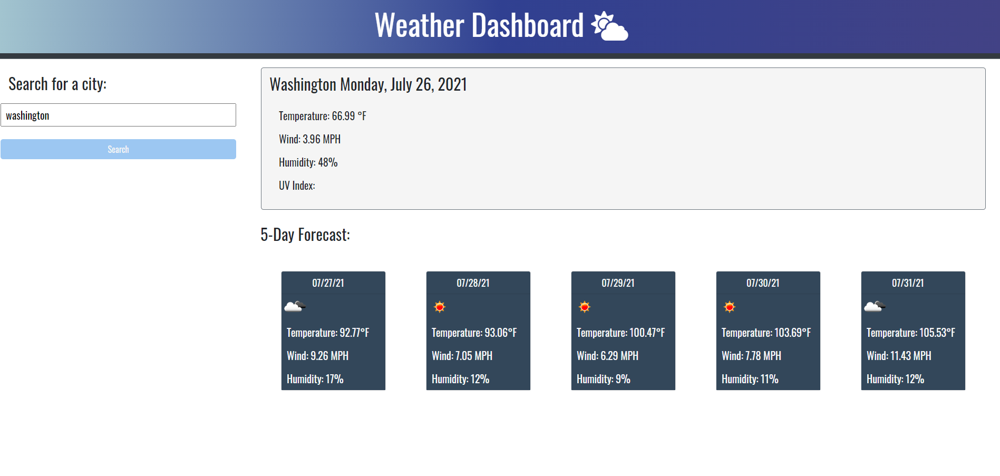

# _Weather-Vision_
> A simple app that lets you view weather in the city you choose.
> Live demo [_here_](https://darolo13.github.io/Weather-Vision/). 

## Table of Contents
* [Technologies Used](#technologies-used)
* [Features](#features)
* [Screenshot](#screenshot)
* [Project Status](#project-status)
* [Room for Improvement](#room-for-improvement)

## Technologies Used
- Tech 1 - JavaScript
- Tech 2 - CSS
- Tech 3 - HTML

## Features
Ready Features:
1. **Show weather**
- Allows to view the weather in the specific city the you search for.
2. **Allows to view the forecast 5 days following to the current date**

## Screenshot
### Weather-Vision:

## Project Status
Project is: _in progress_

## Room for Improvement
Room for improvement:
- TBD

To do:
- Add reset buttons
- Improve design
- Add local Storage
- Add UV index
